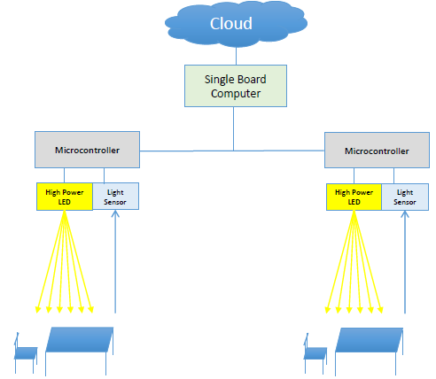

# Real-time control of a smart office illumination system using Arduinos and Raspberry Pi

This project was developed for the Distributed Real-time Control Systems course. It aims to design a real-time control system for a distributed illumination system in a small-scale office space model. Each desk has its own individual smart luminaire consisting of: a luminance sensor (LDR), a lighting emitting device (LED), a presence sensor (push button) and computational and communication elements (Arduinos and Raspberry Pi). The main objective is to minimize energy consumption (by controlling LED dimming level such that the luminance level is above a given threshold for occupied and unoccupied desks taking into account the effect of the external natural lighting) and maximize user comfort (by minimizing the illuminance flicker).

## Architecture

This cooperative distributed control system is composed by: the Arduino nodes (luminaires) which communicate through I2C and have both a local and a global (distributed) controller ensuring therefore energy consumption minimization and user comfort maximization and the embedded PC interface consisting of a Raspberry Pi3 connected to the Arduinos through I2C and to the intranet via WiFi. The Raspberry Pi implements a server providing an interface between an application client and the control nodes in order to collect information from the nodes to compute some evaluation metrics, sending it to a client application for monitoring purposes.  

