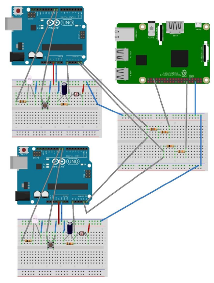
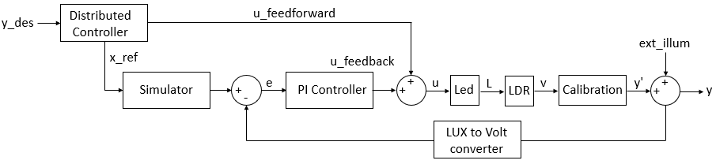
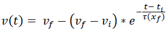
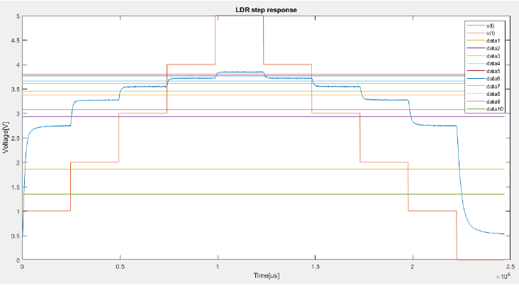
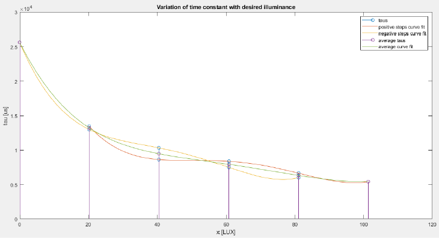
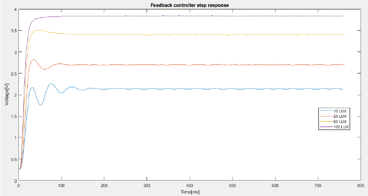
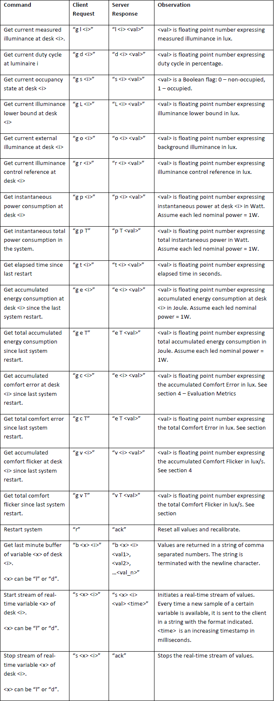
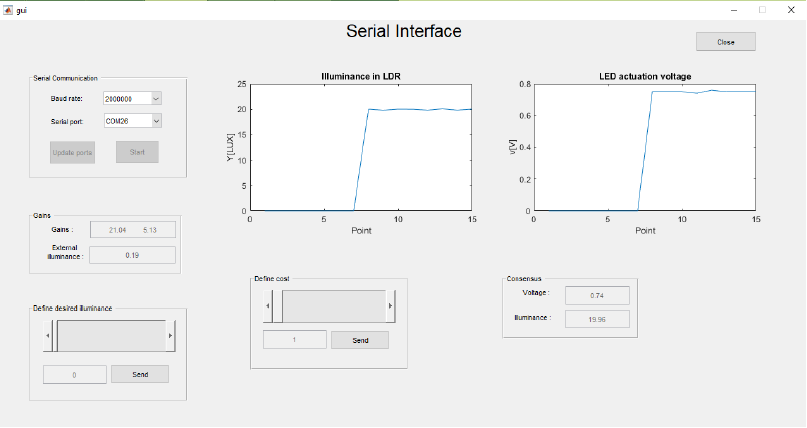

# Real-time control of a smart office illumination system using Arduinos and Raspberry Pi

This project was developed for the Distributed Real-time Control Systems course. It aims to design a real-time control system for a distributed illumination system in a small-scale office space model. Each desk has its own individual smart luminaire consisting of: a luminance sensor (LDR), a lighting emitting device (LED), a presence sensor (push button) and computational and communication elements (Arduinos and Raspberry Pi). The main objective is to minimize energy consumption (by controlling LED dimming level such that the luminance level is above a given threshold for occupied and unoccupied desks taking into account the effect of the external natural lighting) and maximize user comfort (by minimizing the illuminance flicker).

## Architecture

This cooperative distributed control system is composed by: the Arduino nodes (luminaires) which communicate through I2C and have both a local and a global (distributed) controller ensuring therefore energy consumption minimization and user comfort maximization and the embedded PC interface consisting of a Raspberry Pi3 connected to the Arduinos through I2C and to the intranet via WiFi. The Raspberry Pi implements a server providing an interface between an application client and the control nodes in order to collect information from the nodes to compute some evaluation metrics, sending it to a client application for monitoring purposes.  


## Connections



## Arduino code

Besides the .ino code, three c++ libraries were developed:

**lum_system:** contains the methods to [calibrate the LDR](https://www.instructables.com/id/Measuring-Light-Using-Light-Sensor/), read LDR values and compute the I2C data. After calibrating, change the values "m" and "b" on lines 20-21 of the .ino file.

**luminaire_controller:** contains the methods of the individual local luminaire controller consisting on a PI controller with feedforward and anti-windup (check the next section to see how to calibrate this controller).

**dist_controller:** the distributed global controller is based on the [consensus algorithm](https://fenix.tecnico.ulisboa.pt/downloadFile/1689468335597775/consensus.pdf) via the Alternating Direction Method of Multipliers (ADMM) with the goal of minimizing a global cost function based on the energy consumption.

## Local luminaire controller

The configuration of the local controller is displayed on the block diagram below. The simulator block is responsible for delaying the actuation of the PI controller each time the distributed controller changes its reference.



### Simulator

The simulator is ruled by the following expression (where **vi** is the initial voltage, **vf** is the final voltage, **xf** is the final illuminance, **rho** is the capacitor time constant and **ti** is the initial time):



To obtain the equation of the simulator (in the .ino file, it corresponds to the a0... a5 coefficients in lines 41-46), we need to obtain the capacitor time constant. To do that, we represent the LDR step response and check in which points are obtained 63% of the input signal in the output:



Then, to obtain the time constant as a function of the illuminance, we use linear interpolation (5th degree):



**NOTE:** in the utils/simulator_tuning folder, there are the Arduino and Matlab codes for obtaining the simulator coefficients.

### PI Controller

To calibrate the feedback controller (i.e. PI controller), we assume it is a 1st order system caracterized by its static gain and time constant. Hence, the PI constants (kp and kp, lines 48-49 of .ino file) can be obtained using the Matlab function [pidtune](https://www.mathworks.com/help/control/ref/pidtune.html). Probably, you will need to adjust this parameters until reaching a dynamic characteristics as the one below (with low overshoot and low stabilization time).



**NOTE:** in the utils/pi_tuning folder, there are the Arduino and Matlab codes for obtaining the PI parameters.

## EEPROM configuration

Before being fully able to test the arduino code, you need to program the values on addresses 0 and 1 of the EEPROM of each Arduino. On address 0, you must insert the I2C address (unique for each node) and on address 1 you must insert the node ID (0 if is the master, >0 if is it a slave)

**NOTE:** in the utils/EEPROM folder, there is the Arduino code for programming the EEPROM

## Raspberry Pi

The Raspberry Pi code consists on a C++ server using the TCP-IP protocol and asynchronous I/O classes from [Boost’s ASIO library](https://www.boost.org/doc/libs/1_66_0/doc/html/boost_asio.html). The TCP-IP server listens for connections at port 17000 and serves multiple clients. The server is able to send and receive data from the client in string format:



To install the Boost Library:
```
sudo apt-get install libboost-all-dev
```

To run the server:
```
make server
```

To run the client:
```
make client
```

To clean the repo:
```
make clean
```

## Graphical User Interface(GUI)

The arduino program prints, through serial, some messages about the LDR illuminance and the LED actuation voltage over the time. Besides that, it is capable of receiving messages for defining a new desired illuminance value and the cost of the consensus algorithm. In order to display all this info in a more fashionable manner, a Matlab based GUI was developed.

